<div align="center">

# ⚡ GitHub Profile Visualizer

### The ultimate all-in-one developer telemetry & 3D contribution visualizer suite: 3D Isometric City Skylines, Developer Achievements, Commit Velocity Wave, Coding Habits, Competency Radar, Language Distribution, LeetCode, GeeksforGeeks, HackerRank, and Duolingo cards.

[](https://github.com/marketplace/actions/github-profile-visualizer)
[](https://github.com/Tharun4743/github-profile-visualizer/releases)
[](LICENSE)
[](package.json)
[](https://github.com/Tharun4743/github-profile-visualizer/pulls)

<br/>

<!-- Flagship 3D City Preview -->
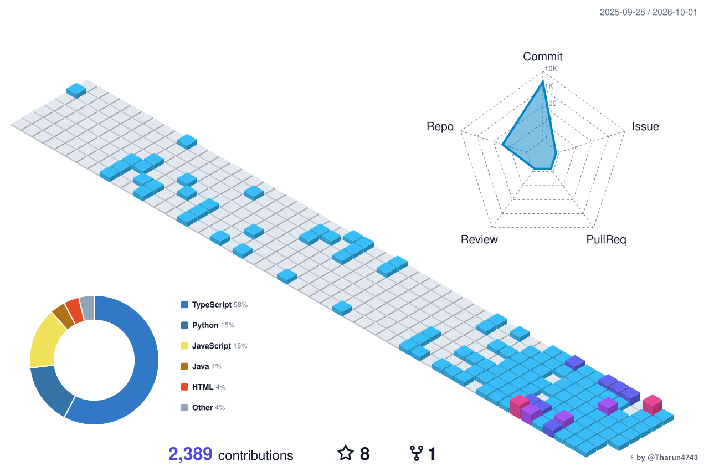

</div>

---

## 🌟 The 13-in-1 Visualizer Suite

Generate **any or all developer telemetry cards in a single, ultra-fast action pass**:

### 1. 🏙️ 3D Isometric Contribution City
* **Pure Mathematical Projection Engine:** Renders 365 days of contribution depth using deterministic isometric math (`isoX = (x - y) * cos(30°)`, `isoY = (x + y) * sin(30°) - height`) with 0 headless-browser dependencies.
* **Auto-Adaptive High-Contrast Themes:** Pure White Pearl Neon, Ocean Breeze (`ocean-light`), Solar Sunrise (`solar-light`), Emerald, Cyberpunk, and more.
* **5-Axis Radar & Accurate Donut Progress:** Multi-metric activity radar (Commit, Issue, PR, Review, Repo) and language percentage ring.

---

### 2. 🎛️ Executive Summary Banner
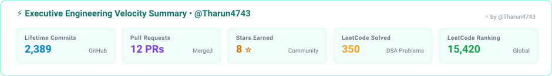

---

### 3. 🏆 Achievements & 📈 Velocity Wave
| 🏆 Developer Achievements & Medals | 📈 Commit Velocity Wave Chart |
| :---: | :---: |
| 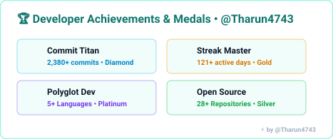 |  |

---

### 4. 🎯 Engineering Radar & 🕒 Coding Habits
| 🎯 Engineering Competency Radar | 🕒 Productive Coding Habits |
| :---: | :---: |
| 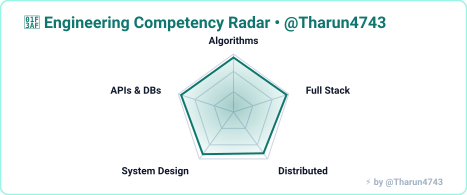 | 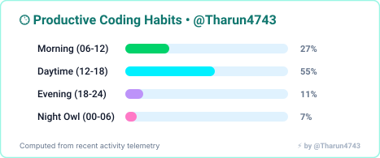 |

---

### 5. 💻 Language Matrix & 📊 GitHub Core Analytics
| 💻 Language Distribution Matrix | 📊 GitHub Core Analytics & Stats |
| :---: | :---: |
| 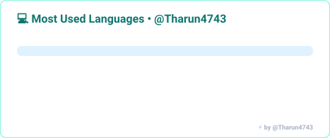 | 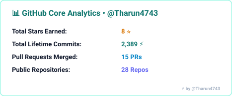 |

---

### 6. ⚡ Live Activity Stream & 🦉 Multi-Platform Cards
<div align="center">

| ⚡ Live Activity Stream | 🦉 Duolingo Streak |
| :---: | :---: |
| 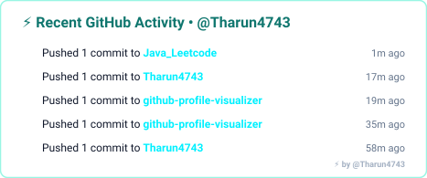 |  |

| 🧩 LeetCode Card | 🌿 GeeksforGeeks Card |
| :---: | :---: |
| 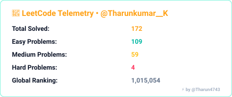 | 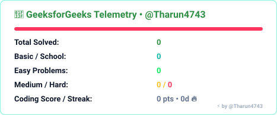 |

</div>

---

## 🎨 Theme Showcase & Customization

Pick from any built-in theme or create your own custom palette:

| Theme Key | Mode | Style & Colors | Best For |
| :--- | :--- | :--- | :--- |
| `ocean-light` / `white-ocean` | ☀️ Pure Light | `#ffffff` background, `#0f766e` teal, `#0284c7` ocean cyan | Ultra-clean modern light profiles |
| `pearl-neon` / `white` | ☀️ Pure Light | `#ffffff` background, vibrant indigo & fuchsia accents | High-contrast modern light profiles |
| `solar-light` / `white-solar` | ☀️ Pure Light | `#ffffff` background, `#c2410c` sunset orange, warm amber | Vibrant energetic light profiles |
| `cyberpunk` | 🌙 Dark | High-voltage neon cyan `#00f0ff` & hot magenta | Futuristic cyberpunk themes |
| `emerald` | 🌙 Dark | GitHub Matrix green `#39d353` & deep obsidian | Classic GitHub contribution aesthetic |
| `tokyonight` | 🌙 Dark | Tokyo Night soft blues `#7aa2f7` & purples | Sleek, eye-friendly dark mode |
| `synthwave` | 🌙 Dark | 80s Synthwave neon pink `#f92aad` & yellow `#fede5d` | Retro retro-wave aesthetic |
| `dracula` | 🌙 Dark | Iconic Dracula purple `#bd93f9` & green `#50fa7b` | Developer-favorite code theme |

### Custom Palette Engine
You can supply your own 5-level hex color ramp and canvas background:
```yaml
with:
  custom-colors: '#161b22,#0e4429,#006d32,#26a641,#39d353'
  custom-bg: '#0d1117' # or '#ffffff' for light
  transparent: 'false'  # Set 'true' for seamless transparent background
```

---

## 📖 Step-by-Step Setup Guide for Your Profile ("Magic") Repo

Transform your special profile repository (`github.com/username/username`) in **4 simple steps**:

### Step 1: Create Workflow Directory
In your GitHub profile repository (`username/username`), create a new directory and workflow file:
```
.github/workflows/profile-visualizers.yml
```

### Step 2: Paste the GitHub Action Workflow
Paste the following complete workflow into `.github/workflows/profile-visualizers.yml`:

```yaml
name: Update Profile Visualizers

on:
  schedule:
    - cron: "0 0,6,12,18 * * *" # Runs automatically every 6 hours
  push:
    branches: [main]
  workflow_dispatch: # Allows manual one-click trigger

permissions:
  contents: write

jobs:
  generate:
    runs-on: ubuntu-latest
    name: Generate Multi-Platform Visualizers
    timeout-minutes: 10

    steps:
      - name: 📥 Checkout Profile Repository
        uses: actions/checkout@v4

      - name: ⚡ Generate All Profile Visualizers
        uses: Tharun4743/github-profile-visualizer@v1
        with:
          username: ${{ github.repository_owner }}
          visualizers: 'all' # Generates all 13 cards in 1 pass
          theme: 'ocean-light' # Options: ocean-light, pearl-neon, solar-light, cyberpunk, emerald, tokyonight, synthwave
          leetcode-username: ${{ github.repository_owner }} # Or custom LeetCode handle
          gfg-username: ${{ github.repository_owner }}      # Or custom GFG handle
          hackerrank-username: ${{ github.repository_owner }} # Or custom HackerRank handle
          duolingo-username: ${{ github.repository_owner }}  # Or custom Duolingo handle
          output-dir: 'assets'
          filename: 'profile-3d-city.svg'

      - name: 🚀 Commit & Push Generated Visualizers
        run: |
          git config user.name "github-actions[bot]"
          git config user.email "github-actions[bot]@users.noreply.github.com"
          git add assets/
          if git diff --cached --quiet; then
            echo "No visualizer changes to commit."
          else
            git commit -m "chore(telemetry): update profile visualizers [skip ci]"
            git pull --rebase origin main
            git push origin main
          fi
```

### Step 3: Enable Workflow Permissions
1. Go to your profile repository on GitHub: `Settings` → `Actions` → `General`.
2. Scroll to **Workflow permissions**.
3. Select **Read and write permissions**.
4. Check **Allow GitHub Actions to create and approve pull requests**.
5. Click **Save**.

### Step 4: Embed the Cards in your `README.md`
Add the following layout snippet to your profile `README.md`:

```html
<!-- 3D Contribution Skyline -->
<div align="center">
  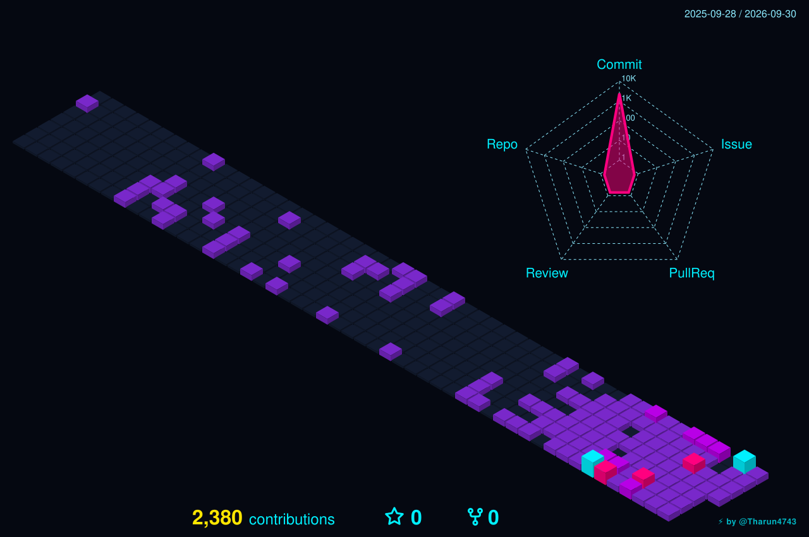
</div>

<!-- Executive Summary Banner -->
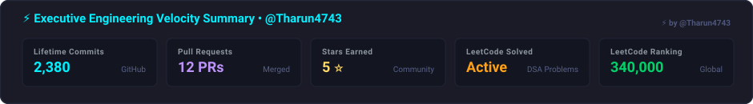

<!-- 2-Column Telemetry Grid -->
<table border="0" width="100%">
  <tr>
    <td width="50%">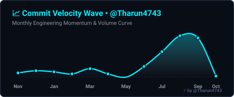</td>
    <td width="50%"></td>
  </tr>
  <tr>
    <td width="50%">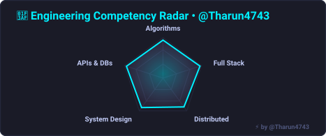</td>
    <td width="50%">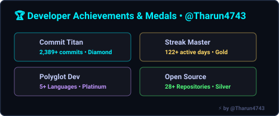</td>
  </tr>
  <tr>
    <td width="50%">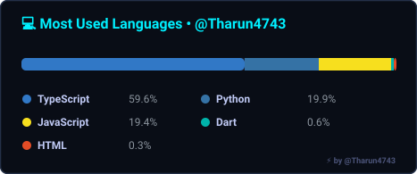</td>
    <td width="50%">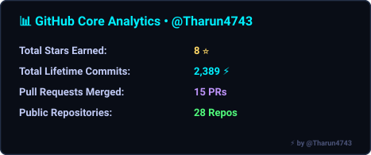</td>
  </tr>
  <tr>
    <td width="50%">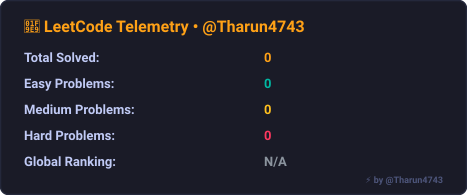</td>
    <td width="50%">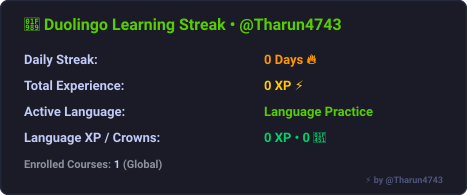</td>
  </tr>
</table>
```

---

## 🤖 One-Click AI / Antigravity Prompt

Want an AI coding assistant (like **Google Antigravity**, **Cursor**, **ChatGPT**, or **Claude**) to automatically set up and enhance your profile repository with this action?

Copy and paste this prompt into your assistant:

```text
Please build and upgrade my GitHub Profile Magic Repository (username/username) into a stunning, world-class developer profile.

STRICT INSTRUCTION:
Do NOT write custom SVG generators, headless scrapers, or ad-hoc scripts from scratch.
You MUST strictly configure and use the official published GitHub Marketplace Action: `Tharun4743/github-profile-visualizer@v1`.

Requirements:
1. Create/update `.github/workflows/profile-visualizers.yml` using `uses: Tharun4743/github-profile-visualizer@v1` with `visualizers: 'all'` and `theme: 'ocean-light'` (or your preferred theme).
2. Configure my platform usernames (GitHub, LeetCode, GeeksforGeeks, HackerRank, Duolingo) in the action parameters.
3. Update `README.md` to embed the generated 3D City (`profile-3d-city.svg`), Executive Summary (`executive-summary.svg`), Commit Velocity Wave, Skills Radar, Coding Habits, Language Matrix, GitHub Stats, and Multi-Platform Cards inside clean responsive tables.
4. Verify that all SVGs sync cleanly into `assets/` on every push and scheduled run.
```

---

## ⚙️ Configuration Inputs & Options

| Input | Description | Default |
| :--- | :--- | :--- |
| `username` | Target GitHub username | `${{ github.repository_owner }}` |
| `visualizers`| Choice of visualizers: `'all'` or comma-separated list (`'3d-city,activity,habits,languages,leetcode,gfg,hackerrank,duolingo,achievements,velocity,radar,summary,stats'`) | `'all'` |
| `theme` | Built-in palette: `ocean-light`, `pearl-neon`, `solar-light`, `cyberpunk`, `emerald`, `tokyonight`, `dracula`, `synthwave` | `'pearl-neon'` |
| `custom-colors` | 5 comma-separated hex codes for custom tower levels | `''` |
| `custom-bg` | Custom canvas background hex color | `''` |
| `transparent` | Render with transparent background for seamless integration (`true`/`false`) | `'false'` |
| `border-radius`| Corner radius in pixels (`0`, `8`, `14`, `20`) | `''` |
| `show-border` | Display card borders (`true`/`false`) | `'true'` |
| `title` | Custom header title for the 3D City | `⚡ {username}'s 3D Contribution City` |
| `height-scale`| Multiplier for 3D tower elevation (`1.0`, `1.5`, `2.0`) | `'1.0'` |
| `animate` | Enable neon lighting reflection animation (`true`/`false`) | `'true'` |
| `year` | Specific calendar year (e.g. `2025`) or `'last-year'` | `'last-year'` |
| `leetcode-username`| LeetCode handle for problem solving telemetry | `${{ github.repository_owner }}` |
| `gfg-username` | GeeksforGeeks handle for problem solving telemetry | `${{ github.repository_owner }}` |
| `hackerrank-username`| HackerRank handle for badges and achievements | `${{ github.repository_owner }}` |
| `duolingo-username`| Duolingo handle for streak and course telemetry | `${{ github.repository_owner }}` |
| `output-dir` | Output folder where SVGs will be saved | `'assets'` |
| `filename` | Output filename for primary 3D city SVG | `'profile-3d-city.svg'` |

---

## 💻 CLI Usage

You can also run the visualizer directly from your terminal or CI runner:

```bash
# Generate all visualizers in White Ocean Light theme
npx github-profile-visualizer --username Tharun4743 --visualizers all --theme ocean-light --output ./assets

# Generate specific cards with custom border radius
npx github-profile-visualizer --username Tharun4743 --visualizers "stats,velocity,radar,summary" --border-radius 16

# Generate Cyberpunk Neon theme
npx github-profile-visualizer --username Tharun4743 --theme cyberpunk --output ./assets
```

---

## 📄 License

Distributed under the [MIT License](LICENSE). Built with ❤️ by [@Tharun4743](https://github.com/Tharun4743).
